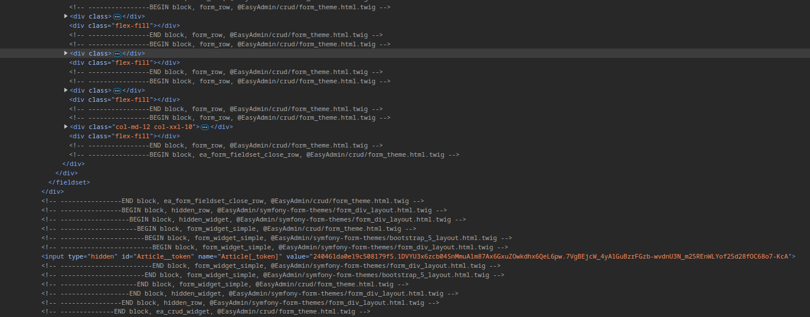

[](https://github.com/lukasz-zaroda/TwigHintsBundle/actions/workflows/main.yml)
# Installation

```bash
composer require lukasz-zaroda/twig-hints-bundle
```
Add to your `config/bundles.php`:
```php
LukaszZaroda\TwigHintsBundle\TwigHintsBundle::class => ['dev' => true]
```

By specifying `'dev' => true` you make sure that hints will be added only in the `dev` environment.

# How does it look

